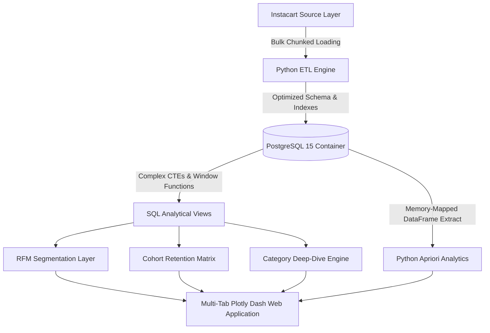

# Instacart Customer & Operations Intelligence Platform
Customer Analytics · RFM Behavioral Segmentation · Market Basket Analysis · Cohort Retention · Plotly Dash Platform

An end-to-end analytics platform and data engineering pipeline built on 3.4M+ transactional records to optimize customer retention, product merchandising, and cross-sell velocity. This project engineers a local Dockerized PostgreSQL data warehouse, executes advanced SQL/Python analytical layers, and exposes interactive business intelligence via a production-ready, multi-page Plotly Dash application.

---

## Project Value

This project turns messy retail transactions into a clean enterprise analytics warehouse with reusable SQL assets, reliable loading, and executive-ready metrics.

It is especially strong for:
- Data Analyst
- Business Analyst
- Analytics Engineer
- Business Intelligence Analyst
- Analytics Associate

---

## Business Case & Objectives

In high-frequency e-commerce and grocery retail, marginal improvements in retention and average order value directly drive profitability. This platform addresses critical executive questions:

- Which customer cohorts are exhibiting churn signatures, and how can marketing personalize mitigation campaigns?
- Which departments and individual products act as high-velocity drivers for repeat purchases?
- What latent product dependencies exist across historical orders that can be exploited for bundle promotions or algorithmic recommendations?

---

## Data Warehouse Profile

The analytical engines ingest the anonymized **Instacart Market Basket Analysis** dataset, representing a highly dense relational network of consumer behavior.

| Core Entity | Structural Metric |
| :--- | ---: |
| Total Orders Processed | 3,421,083 |
| Unique Customer Cohorts | 206,209 |
| Product SKU Catalog Size | 49,688 |
| Fulfillment Departments | 21 |
| Baseline Platform Reorder Rate | 59.0% |

### Ingested Relational Schema
- `orders.csv` — User order cadences, weekdays, and hours of purchase.
- `order_products__prior.csv` / `order_products__train.csv` — Basket-level line item layouts and reorder flags.
- `products.csv`, `aisles.csv`, `departments.csv` — Comprehensive product catalog metadata.

---

## System Architecture



---

## Specialized Solution Modules

### Module 1 — RFM Customer Segmentation
Leveraged SQL window functions and NTILE(5) scoring to map the 206,209-user base into behavioral segments based on transactional Recency, Frequency, and Monetary value.

| Strategic Segment | User Count | Core Operational Action Item |
| :--- | ---: | :--- |
| Champions | 15,978 | Reward with early access, VIP perks, and organic advocacy channels. |
| Loyal Customers | 52,655 | Upsell high-margin verticals; integrate personalized loyalty programs. |
| New Customers | 24,233 | Trigger onboarding drip campaigns to secure the critical 2nd and 3rd orders. |
| At Risk | 55,092 | Primary retention target: execute aggressive win-back email promotions. |
| Hibernating / Lost | 58,251 | Automate low-cost re-engagement triggers; run win-back lookalike modeling. |

**Data-driven insight:** 26.7% of the customer footprint is in **At Risk**, making this the single highest revenue recovery opportunity for the marketing team.

### Module 2 — Cohort Retention & Reorder Velocity
Quantified behavioral decay and longitudinal user engagement across sequential order milestones.

- Retention stands structurally at 100% through order 3 by dataset constraint.
- Retention drops to 71% by order 6.
- Retention stabilizes at 42% by order 12.
- Produce generates a 65%+ reorder rate, materially outperforming the platform average.

### Module 3 — Market Basket Analysis
Executed Apriori association mining across 15,000 transactional basket samples.

- Organic Strawberries → Organic Raspberries, Lift: 3.26 | Confidence: 29.1%
- Bag of Organic Bananas → Organic Raspberries, Lift: 2.98 | Confidence: 24.3%
- Large Lemon → Organic Baby Spinach, Lift: 2.93 | Confidence: 21.8%

**Data-driven insight:** The strongest affinities exist within the organic produce subset. Merchandising layouts should co-locate these items, and promotional bundles should preserve margin by avoiding unnecessary discounting on naturally high-lift pairs.

### Module 4 — Category & SKU Volume Analysis
Isolated the core volume drivers across 21 departments.

- Produce: 9.9M total line-item volume, 65% reorder rate.
- Dairy & Eggs: 5.6M total line-item volume, 62% reorder rate.
- Snacks: 3.0M total line-item volume, high-margin introductory vertical.

Top 3 SKUs:
- Bananas — 491,291 units
- Bag of Organic Bananas — 394,930 units
- Organic Strawberries — 264,683 units

---

## Interactive Dashboard Platform

The front-end user experience is powered by a 4-tab Plotly Dash application connected natively to the PostgreSQL warehouse.

### Tab 1 — Executive Overview
Surfaces corporate health metrics, including Total Orders, Distinct Customer Cohorts, and System Reorder Rate, plus temporal heatmaps for order velocities across hours of the day and days of the week.

### Tab 2 — Customer Lifecycle Analytics
Visualizes the distribution of RFM behavioral clusters with filtering controls for rapid cohort analysis.

### Tab 3 — Merchandising & Category Intelligence
Monitors volumetric output and reorder efficiency across departments, isolating high-velocity items via dynamic heatmaps.

### Tab 4 — Market Basket Rules Interface
Plots association rules on a support-confidence-lift diagnostic view with matching sortable rule tables.

---

## Tech Stack

- Python · pandas · NumPy
- PostgreSQL 15 · Docker
- SQL (Window Functions, CTEs, Cohort Queries)
- Plotly (static chart exports)
- Power BI / Looker Studio

---

## Repository Structure

```text
instacart-intelligence-platform/
├── dashboard/
│   └── app.py
├── data/
│   ├── processed/
│   └── raw/
├── sql/
│   ├── schema.sql
│   ├── rfm_analysis.sql
│   ├── retention_matrix.sql
│   └── category_deepdive.sql
├── src/
│   ├── database_loader.py
│   ├── market_basket.py
│   └── clv_rfm_engine.py
├── reports/
├── docker-compose.yml
└── README.md
```

---

## How to Run

```bash
git clone <repository-url>
cd instacart-intelligence-platform

# Download the dataset from Kaggle and place all files in ./data/raw/

docker compose up -d

docker exec -i instacart_postgres psql -U postgres -d instacart_db < sql/schema.sql

python src/database_loader.py

docker exec -i instacart_postgres psql -U postgres -d instacart_db < sql/rfm_analysis.sql

python src/market_basket.py

python dashboard/app.py
```

Open:
- http://127.0.0.1:8050

---

## Key Metrics

- 3,421,083 orders analyzed.
- 206,209 customers segmented into 5 RFM tiers.
- 55,092 at-risk customers identified for retention targeting.
- 59% platform reorder rate.
- 3.26x lift on the top product association rule.
- 42% 12-order cohort retention rate.

---

## Reports

### Executive Overview


### Customer Analytics


### Product & Category


### Market Basket Analysis


---

## What This Demonstrates

- Production ETL pipeline handling 3.4M+ rows with chunked bulk loading.
- SQL analytics using window functions, CTEs, and NTILE scoring.
- Behavioral customer segmentation at scale.
- Association rule mining for product affinity discovery.
- Multi-page interactive dashboard connected to a live database.
- Docker-based reproducible warehouse environment.