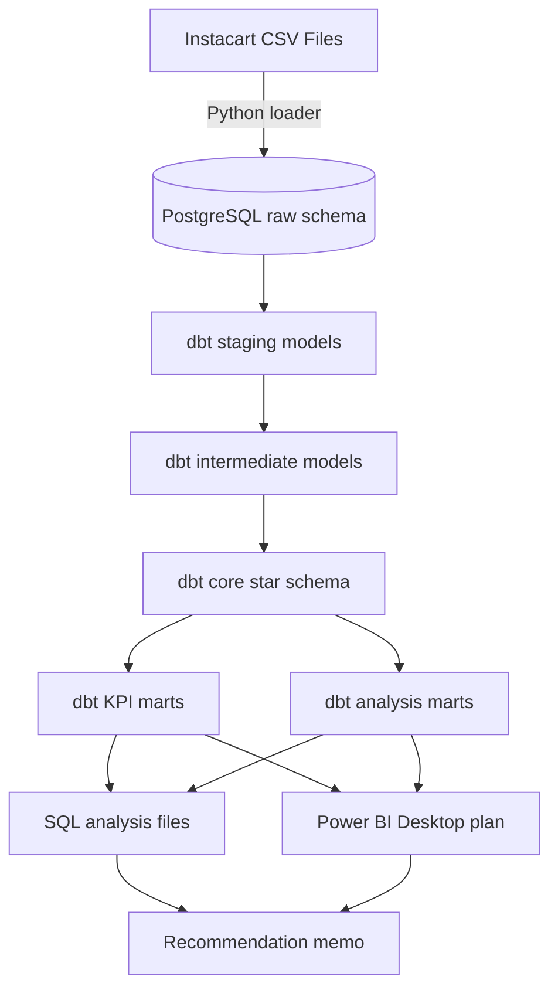
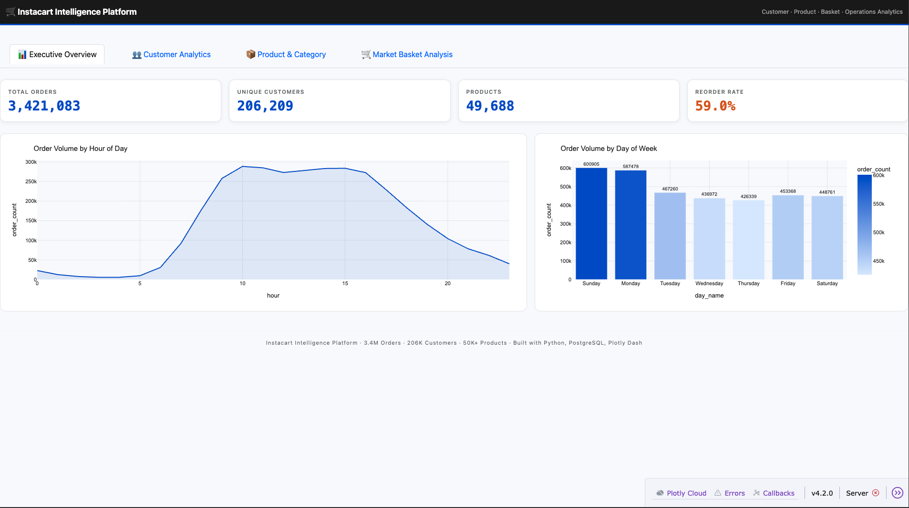
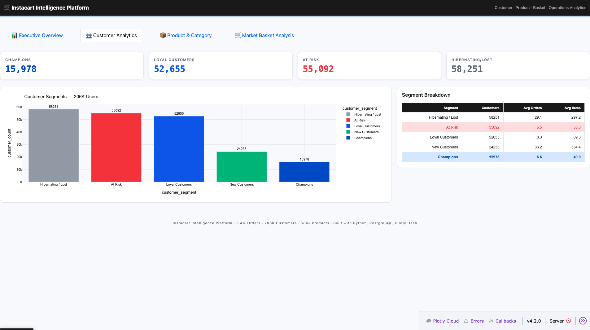
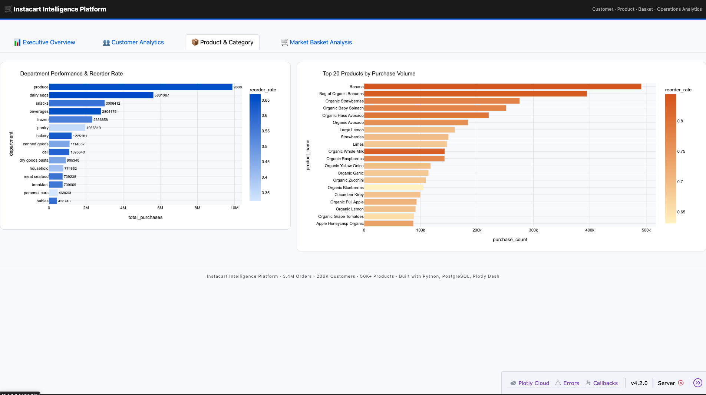
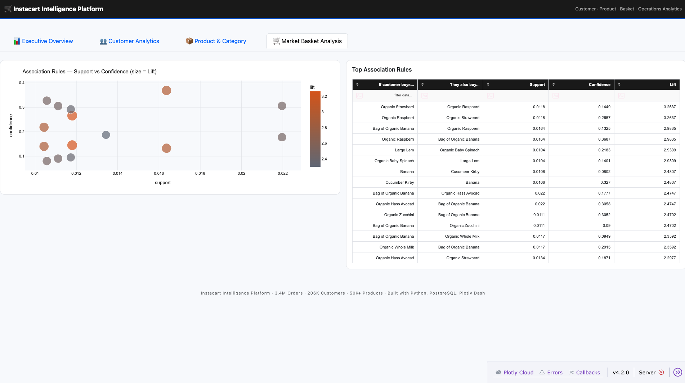

# Instacart Customer & Operations Intelligence Platform

       

Analytics Engineering · PostgreSQL Warehouse · dbt Core · SQL Analysis · Power BI Planning

An end-to-end analytics engineering and BI project built on the public Instacart order dataset to analyze customer behavior, product performance, cohort retention, and basket affinity. This project engineers a local Dockerized PostgreSQL warehouse, models reusable analytics layers with dbt Core, adds recruiter-readable SQL analysis, and defines a Power BI dashboard plan connected to validated dbt marts.

---

## Project Value

This project turns retail transaction data into a clean analytics warehouse with reusable SQL assets, reliable loading, tested dbt models, business KPI marts, and executive-ready BI documentation.

It is especially strong for:
- Data Analyst
- Business Analyst
- Analytics Engineer
- Business Intelligence Analyst
- Product Analyst
- Junior Data Engineer

---

## Business Case & Objectives

In high-frequency e-commerce and grocery retail, improvements in repeat purchase behavior, basket composition, and customer lifecycle timing can directly inform retention and merchandising strategy. This platform addresses critical executive questions:

- Which customer cohorts continue through later observed order milestones?
- Which departments and individual products act as high-velocity drivers for repeat purchases?
- Which product pairs appear together often enough to support merchandising, placement, or cross-sell analysis?

---

## Data Warehouse Profile

The analytical engines ingest the anonymized **Instacart Market Basket Analysis** dataset, representing a dense relational network of consumer shopping behavior.

| Core Entity | Structural Metric |
| :--- | ---: |
| Total Orders Processed | 3,421,083 |
| Unique Customers | 206,209 |
| Product SKU Catalog Size | 49,688 |
| Active Departments | 21 |
| Platform Reorder Rate | 59.01% |

### Ingested Relational Schema
- `orders.csv` — User order cadences, weekdays, and hours of purchase.
- `order_products__prior.csv` / `order_products__train.csv` — Basket-level line item layouts and reorder flags.
- `order_products.csv` — Combined order-product line item file used by the PostgreSQL loader.
- `products.csv`, `aisles.csv`, `departments.csv` — Product catalog and category metadata.

---

## System Architecture



Detailed architecture notes are available in:
- `docs/architecture.md`
- `docs/architecture_diagram.mmd`

---

## Specialized Solution Modules

### Module 1 — Behavioral Customer Engagement Segmentation
The dbt mart `mart_customer_segments` uses transparent SQL scoring to segment customers by observed order frequency, average basket size, reorder behavior, and a latest reorder-gap proxy.

Segmentation inputs:
- **Recency proxy:** `latest_days_since_prior_order` from each customer's latest observed order. This is not calendar recency.
- **Frequency:** observed order count per customer.
- **Basket behavior:** average basket size and total purchased line items.
- **Reorder behavior:** customer-level share of items marked as reordered.

| Behavioral Segment | User Count | Core Operational Action Item |
| :--- | ---: | :--- |
| High Engagement | 28,883 | Maintain loyalty and reinforce repeat behavior. |
| Loyal Routine | 62,818 | Support recurring habits and category expansion. |
| Moderate Engagement | 69,635 | Identify opportunities to deepen engagement. |
| At Risk | 44,873 | Review lifecycle messaging and reorder timing. |
| Early Lifecycle | 0 | Focus on onboarding and second-order activation. |

**Data-driven insight:** Moderate Engagement is the largest segment with 69,635 customers, followed by Loyal Routine with 62,818 customers.

### Module 2 — Cohort Retention & Reorder Velocity
The dbt mart `mart_cohort_retention` quantifies customer continuation across observed order-sequence milestones.

- Retention is based on order sequence, not calendar dates.
- `observed_order_number` is the BI-facing milestone.
- `retention_rate` is calculated as active customers at the milestone divided by starting customers.

Validated retention insights:
- 100.00% of customers are observed through order 3, 88.37% through order 5, 53.70% through order 10, 36.41% through order 15, and 26.15% through order 20.

### Module 3 — Basket Affinity Analysis
The dbt mart `mart_basket_affinity` performs SQL-first product affinity analysis for frequently co-occurring product pairs.

Metrics:
- `orders_with_a`
- `orders_with_b`
- `orders_with_both`
- `support`
- `confidence_a_to_b`
- `lift`

Validated product-pair insights:
- Strongest lift pair: Yogurt, Sheep Milk, Strawberry + Yogurt, Sheep Milk, Blackberry with 421 co-orders, 0.0123% support, 41.89% confidence, and 1,431.68 lift.
- Highest support pair: Bag of Organic Bananas + Organic Hass Avocado with 64,761 co-orders, 1.8930% support, 16.40% confidence, and 2.54 lift.

### Module 4 — Category & SKU Volume Analysis
The dbt mart `mart_product_performance` isolates product, aisle, and department performance.

Metrics:
- `total_order_items`
- `distinct_orders`
- `distinct_customers`
- `reorder_rate`

Validated category and SKU insights:
- Top SKU by item volume is Banana with 491,291 order items and an 84.51% reorder rate.
- Top department is produce with 9,888,378 order items; top aisle is fresh fruits with 3,792,661 order items.

---

## Interactive Dashboard Platform

The final BI output is planned for Power BI Desktop and should connect to dbt marts, not raw tables.

Power BI planning assets:
- `bi/powerbi_dashboard_plan.md`
- `bi/data_dictionary.md`

### Page 1 — Executive Overview
Surfaces headline metrics from `analytics_kpis.mart_executive_kpis`, including total orders, total customers, total products, total order items, reorder rate, average basket size, average orders per customer, active departments, and top department by items.

### Page 2 — Product Performance
Analyzes product, aisle, and department performance to identify top-selling products, reorder behavior, and merchandising opportunities across the catalog.

### Page 3 — Customer Segments
Explores behavioral customer segments based on purchasing frequency, basket size, and reorder patterns to support targeted engagement strategies.

### Page 4 — Cohort Retention
Tracks customer retention across successive purchase milestones, helping identify where repeat purchasing begins to decline over the customer lifecycle.

### Page 5 — Basket Affinity
Highlights frequently purchased product combinations using support, confidence, and lift metrics to uncover cross-selling and product placement opportunities.

### Page 6 — Business Recommendations
Summarizes validated business insights and actionable recommendations derived from customer behavior, product performance, retention analysis, and basket affinity findings.

---

## Tech Stack

- Python · pandas
- PostgreSQL 15 · Docker Compose
- dbt Core · dbt-postgres
- SQL with CTEs, window functions, tests, and analytical marts
- Power BI Desktop planning
- Mermaid architecture documentation
- Plotly Dash assets retained from the original project

---

## Repository Structure

```text
instacart-intelligence-platform/
├── analysis/
│   ├── basket_affinity.sql
│   ├── cohort_retention.sql
│   ├── customer_segments.sql
│   ├── executive_kpis.sql
│   ├── product_performance.sql
│   └── recommendation_memo.md
├── bi/
│   ├── data_dictionary.md
│   └── powerbi_dashboard_plan.md
├── dashboard/
│   └── app.py
├── data/
│   ├── processed/
│   └── raw/
├── dbt/
│   ├── README.md
│   ├── dbt_project.yml
│   ├── profiles.yml.example
│   ├── models/
│   │   ├── sources.yml
│   │   ├── staging/
│   │   ├── intermediate/
│   │   └── marts/
│   │       ├── core/
│   │       ├── kpis/
│   │       └── analysis/
│   └── tests/
├── docs/
│   ├── architecture.md
│   └── architecture_diagram.mmd
├── reports/
├── sql/
│   ├── schema.sql
│   ├── rfm_analysis.sql
│   ├── retention_matrix.sql
│   └── category_deepdive.sql
├── src/
│   ├── database_loader.py
│   ├── market_basket.py
│   └── clv_rfm_engine.py
├── .env.example
├── docker-compose.yml
├── requirements.txt
└── README.md
```

---

## How to Run

```bash
git clone <repository-url>
cd instacart-intelligence-platform

# Install Python dependencies
python3 -m venv venv
source venv/bin/activate
pip install -r requirements.txt

# Configure local PostgreSQL settings
cp .env.example .env

# Start PostgreSQL
docker compose up -d

# Load CSVs into the PostgreSQL raw schema
python src/database_loader.py

# Configure dbt
cp dbt/profiles.yml.example dbt/profiles.yml
export DBT_PROFILES_DIR=./dbt

# Validate and build dbt models
dbt debug --project-dir dbt
dbt run --project-dir dbt --select +path:models/marts
dbt test --project-dir dbt

# Run recruiter-readable analysis SQL
psql -h localhost -p 5434 -U postgres -d instacart_db -f analysis/executive_kpis.sql
psql -h localhost -p 5434 -U postgres -d instacart_db -f analysis/product_performance.sql
psql -h localhost -p 5434 -U postgres -d instacart_db -f analysis/customer_segments.sql
psql -h localhost -p 5434 -U postgres -d instacart_db -f analysis/cohort_retention.sql
psql -h localhost -p 5434 -U postgres -d instacart_db -f analysis/basket_affinity.sql
```

Cleanup:

```bash
docker compose down

# Full local PostgreSQL volume reset
docker compose down -v
```

---

## Key Metrics

- Total orders analyzed: 3,421,083.
- Total customers analyzed: 206,209.
- Total products analyzed: 49,688.
- Total order items analyzed: 33,819,106.
- Platform reorder rate: 59.01%.
- Average basket size: 9.89 items.
- Average orders per customer: 16.59.
- Active departments: 21.
- Top department by items: produce.
- Largest behavioral customer segment: Moderate Engagement with 69,635 customers.
- Retention at selected observed order milestones: order 1 100.00%, order 2 100.00%, order 3 100.00%, order 5 88.37%, order 10 53.70%, order 15 36.41%, order 20 26.15%.
- Top product affinity pairs by lift/support: strongest lift is Yogurt, Sheep Milk, Strawberry + Yogurt, Sheep Milk, Blackberry at 1,431.68 lift; highest support is Bag of Organic Bananas + Organic Hass Avocado at 1.8930% support.

---

## Reports

### Executive Overview


### Customer Analytics


### Product & Category


### Market Basket Analysis


Additional existing report assets:
- `reports/basket_affinity_map.png`
- `reports/category_performance.png`
- `reports/customer_segments.png`

Power BI screenshot placeholders are documented in `bi/powerbi_dashboard_plan.md` and should be exported only after dashboard validation.

---

## What This Demonstrates

- PostgreSQL-first analytics warehouse using a local Dockerized database.
- Reproducible raw CSV loading through `src/database_loader.py`.
- dbt Core sources, staging models, intermediate models, star schema, KPI marts, and analysis marts.
- Tested model contracts with `not_null`, `unique`, `relationships`, `accepted_values`, and custom grain tests.
- SQL-first analysis files that query dbt marts rather than raw tables.
- Behavioral customer segmentation without revenue, CLV, or predictive modeling.
- Order-sequence cohort retention without unsupported calendar-date assumptions.
- Product affinity analysis framed as SQL-based BI, not machine learning.
- Power BI dashboard planning connected to dbt marts.
- Architecture and data dictionary documentation suitable for a portfolio review.

---

## Data Limitations

- The Instacart dataset does not include product prices.
- Revenue, profit, margin, AOV, and CLV should not be calculated.
- The dataset does not include real calendar order dates.
- Cohort retention is based on observed order sequence, not weekly or monthly calendar cohorts.
- `days_since_prior_order` supports a reorder-gap proxy, not true calendar recency.
- Basket affinity is product co-occurrence analysis, not prediction.
- High lift does not imply causation.
- Customer segments are behavioral engagement groups, not financial RFM segments.
- Final metric values should be filled only after PostgreSQL load, dbt run, dbt tests, and analysis SQL validation.
